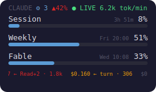
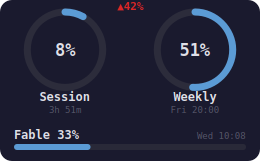
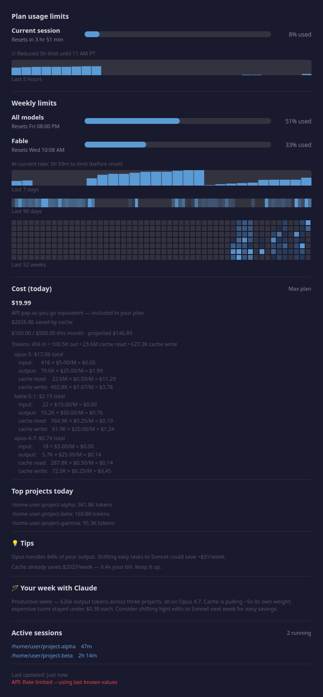
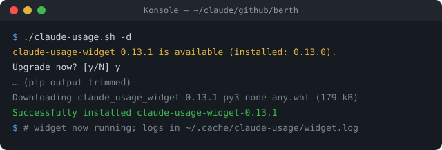

# Berth

A berth is where a ship ties up between voyages. This is the same idea for
Claude helper apps: one place where third-party tools are installed, each in its
own isolated environment, with a small launcher that knows how to start it.

It holds no app code. Every app is installed from its package registry into a
gitignored `<app>-venv/`. What this repo tracks is the launcher for each app plus
the notes needed to reinstall or upgrade it: commands, upgrade history and known
quirks.

> **Not affiliated with Anthropic,** and not with the authors of the apps below.
> Each app belongs to its author; see [Credits](#credits).

Companion to [plimsoll](https://github.com/boaglio/plimsoll), which marks how
close you are to your Claude Code usage limits.

## Apps

### claude-usage-widget

A desktop overlay and CLI showing real-time Claude Code usage limits and cost,
by [bozdemir](https://github.com/bozdemir/claude-usage-widget) (MIT). Launcher:
[`claude-usage.sh`](claude-usage.sh).

<p align="center">
  
  &nbsp;
  
</p>

Click the overlay for the full breakdown: limits with reset times, usage
history, cost per model and the busiest projects.

<p align="center">
  
</p>

<sub>Screenshots from the upstream project at v0.13.1; they show sample data.</sub>

## Setup

```sh
git clone https://github.com/boaglio/berth ~/claude/github/berth
cd ~/claude/github/berth

python3 -m venv claude-usage-widget-venv
claude-usage-widget-venv/bin/pip install claude-usage-widget

./claude-usage.sh --version
```

The venv must sit next to its launcher, which finds it relative to its own
path. A venv cannot be moved after it is created, because its scripts hard-code
their absolute path. To move berth, clone it again and rebuild the venv.

## Run

Always start an app through its launcher, not through the venv's binary. The
launcher finds the venv, warns when there is no display and checks for updates.

```sh
./claude-usage.sh                 # GUI in the foreground
./claude-usage.sh -d              # GUI in the background; logs in ~/.cache/claude-usage/widget.log
./claude-usage.sh --once          # one JSON usage snapshot, no display needed
./claude-usage.sh --statusline    # one compact line for Claude Code's statusLine setting
./claude-usage.sh --export csv --days 30 > usage.csv
```

**Start the GUI from a real desktop terminal such as Konsole.** Started from
inside a Claude Code session, `-d` dies silently, and the session's sandbox
cannot read `~/.claude`, so the CLI there reports zero usage.

## Update check

When you start the GUI, the launcher asks PyPI whether there is a newer release
(3-second timeout). If you are in a terminal, it offers to upgrade the venv,
PySide6 included, before starting the app:

<p align="center">
  
</p>

With no terminal, as in autostart, it prints a one-line notice and starts the
installed version. Headless flags such as `--once` and `--statusline` skip the
check, so they stay fast and work offline. If PyPI can't be reached, the app
starts as usual. To turn the check off:

```sh
CLAUDE_USAGE_NO_UPDATE_CHECK=1 ./claude-usage.sh
```

The widget also has its own notice: "Update with: pip install --upgrade
claude-usage-widget". Don't use that command here, because a bare `pip` would
upgrade the wrong Python and miss the venv. The widget forgets the notice
between runs, so it shows it again on every start until you upgrade.

To upgrade by hand:

```sh
claude-usage-widget-venv/bin/pip list --outdated
claude-usage-widget-venv/bin/pip install -U pip claude-usage-widget PySide6_Essentials shiboken6 certifi
```

## Layout

```
<app>.sh                     Launcher: finds the venv, checks for a display and updates, starts the app.
<app>-venv/                  The app's isolated environment (gitignored, rebuilt from PyPI).
AGENTS.md                    Notes for coding agents: conventions, upgrade log, known log noise.
docs/                        README images.
.claude/settings.local.json  Machine-local Claude Code permissions (gitignored).
```

Runtime state lives outside the repo, under `~/.cache/<app>/` and
`~/.config/<app>/`.

## Adding an app

1. Install it into a sibling venv: `python3 -m venv <app>-venv && <app>-venv/bin/pip install <app>`.
2. Copy `claude-usage.sh` to `<app>.sh` and change the venv and binary names.
   Keep `set -euo pipefail`, and keep resolving paths through `BASH_SOURCE`.
3. Add the app to the "Installed apps" list in [AGENTS.md](AGENTS.md) and to
   [Apps](#apps) above.

**Never edit files inside a venv to fix an app.** A reinstall overwrites them
and git doesn't track them. Fix it upstream, or work around it in the launcher.

## Credits

- [claude-usage-widget](https://github.com/bozdemir/claude-usage-widget) by
  bozdemir, MIT. The screenshots in `docs/*.png` come from its repository.
